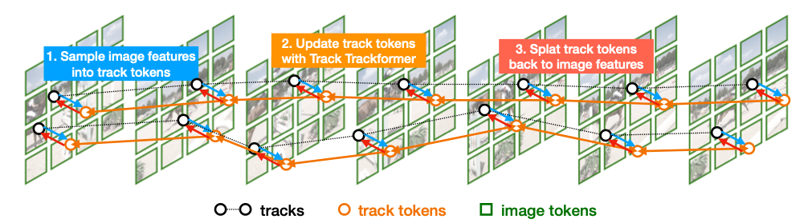
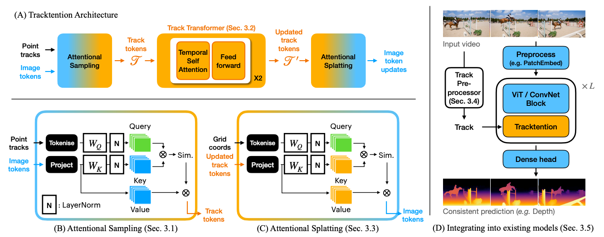

# Tracktention: Leveraging Point Tracking to Attend Videos Faster and Better



> A plug-and-play transformer layer to turn image-based models into state-of-the-art video models using point tracking.

## 🧠 Summary

**Tracktention** is a novel architectural module that improves temporal consistency in video tasks like depth estimation and colorization. It leverages modern point trackers to explicitly align features across frames using **Tracktention** — converting powerful image-based models into robust, temporally aware video models with minimal overhead.

## 🔧 Features

- **Tracktention Layer**: Enhances any ViT/ConvNet with motion-aware temporal reasoning.
- **Plug-and-Play**: Easily integrates into existing models like `Depth Anything`.
- **Lightweight**: Only ~17M additional parameters with minimal runtime overhead.
- **State-of-the-Art**: Outperforms leading video models in depth prediction and video colorization benchmarks.

## 🧬 Method

Tracktention consists of:

1. **Attentional Sampling**: Pool features from image tokens to track tokens using cross-attention.
2. **Track Transformer**: Propagate features along tracks for temporal consistency.
3. **Attentional Splatting**: Redistribute processed track tokens back to image tokens.



We use [CoTracker3](https://github.com/facebookresearch/co-tracker) to generate point tracks.


## 🧪 Usage
**Note:** Usage instructions will be provided once the codebase is officially released.

## 📄 Citation

If you use this code or Tracktention in your research, please cite:

```bibtex
@inproceedings{lai2025tracktention,
  title={Tracktention: Leveraging Point Tracking to Attend Videos Faster and Better},
  author={Zihang Lai and Andrea Vedaldi},
  booktitle={CVPR},
  year={2025}
}
```

## 🌐 Project Page

👉 [https://zlai0.github.io/TrackTention](https://zlai0.github.io/TrackTention)
